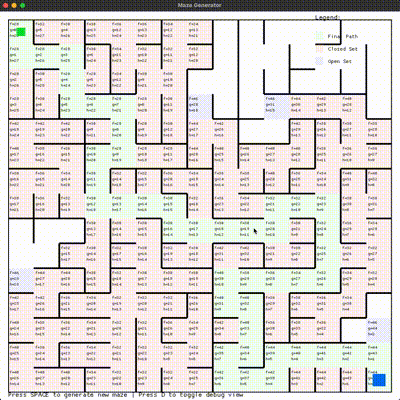

# Rust Maze Generator and Pathfinder

A visual maze generation and pathfinding demonstration built with Rust, using macroquad for graphics and knossos for maze generation. The program generates random mazes and shows how the A* pathfinding algorithm finds the optimal path from start to finish.

<p align="center">
  
</p>

<p align="center">
  <em>Demonstration showing maze generation, A* pathfinding visualization, and sprite navigation</em>
</p>

## Building and Running

### Development Build

1. Ensure you have Rust installed (built with rust v1.87.0)
2. Clone this repository
3. Clone the forked knossos repository:
   ```bash
   # From the parent directory of rust-maze
   git clone https://github.com/pegelston/knossos.git
   cd knossos
   git checkout pegelston/pub-mod
   cd ../rust-maze
   ```
   Note: The knossos repository must be located at `../knossos` relative to the rust-maze project root.
4. Run with:
   ```bash
   cargo run
   ```

## Features

- **Maze Generation**: Uses Kruskal's algorithm to generate random perfect mazes
- **Pathfinding**: Implements A* algorithm to find the shortest path
- **Interactive Visualization**: 
  - Blue sprite that follows the optimal path
  - Green square marking the start point
  - Red square marking the end point
  - Debug view showing the A* algorithm's decision-making process

## Controls

- **Space Bar**: Generate a new random maze
- **D Key**: Toggle debug visualization overlay

## Debug Visualization

When debug mode is enabled (press D), you can see:

- **Color Coding**:
  - Light Blue: Cells in the "open set" (to be evaluated)
  - Light Red: Cells in the "closed set" (already evaluated)
  - Light Green: The final chosen path

- **Cell Information**:
  - `f`: Total estimated cost (g + h)
  - `g`: Actual cost from start
  - `h`: Heuristic (estimated cost to goal)

## How It Works

### Maze Generation
The maze is generated using Kruskal's algorithm, which:
1. Starts with all walls intact
2. Randomly removes walls while ensuring no cycles are created
3. Results in a perfect maze (exactly one path between any two points)

### A* Pathfinding
The pathfinding uses the A* algorithm, which:
1. Explores paths based on both actual cost (g_score) and estimated cost to goal (h_score)
2. Uses Manhattan distance as its heuristic
3. Guarantees the shortest possible path
4. Visualizes the exploration process in debug mode

## Dependencies

- [macroquad](https://github.com/not-fl3/macroquad) (0.4.4): Graphics and window management
- [knossos](https://crates.io/crates/knossos) (1.2.0): Maze generation algorithms
- [rand](https://crates.io/crates/rand) (0.8.5): Random number generation

### Production Build

For optimal performance, build with release optimizations:

```bash
# Build the release version
cargo build --release

# Run the release version
./target/release/rust-maze
```

The release build includes:
- Full optimization (`-O3`)
- Link-time optimization (LTO)
- Improved runtime performance
- Smaller binary size
- Disabled debug assertions
